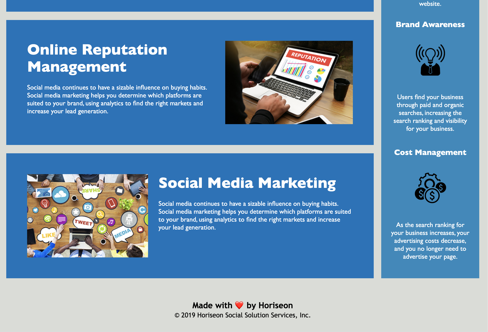

The Horiseon website was outdated when it came to accessibility. I updated the code to include semantic html, added image alternate text and made a few design tweaks. I also consolidated the css and made the overall code easier to work with for future updates.

